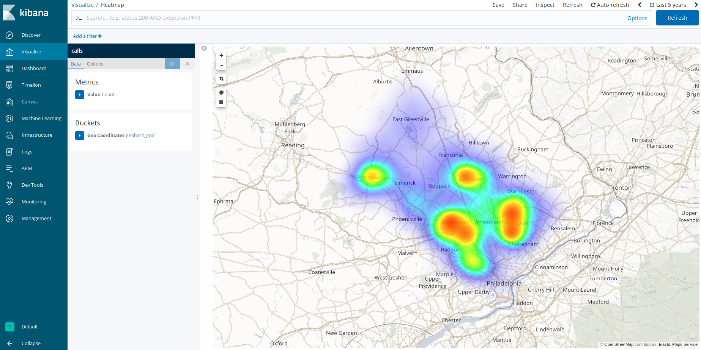
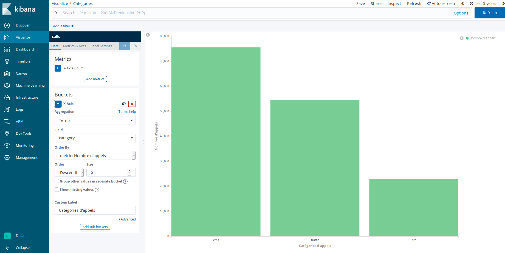
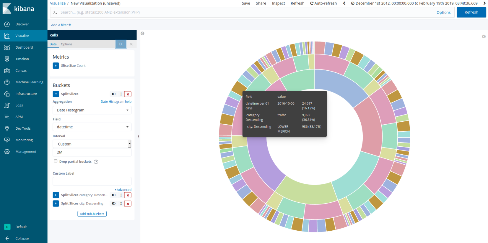

# 911 Calls avec ElasticSearch

## Import du jeu de données

Pour importer le jeu de données, complétez le script `import.js` (ici aussi, cherchez le `TODO` dans le code :wink:).

Exécutez-le ensuite :

```bash
npm install
node import.js
```

Vérifiez que les données ont été importées correctement grâce au shell (le nombre total de documents doit être `153194`) :

```
GET <nom de votre index>/_count
```

## Requêtes

À vous de jouer ! Écrivez les requêtes ElasticSearch permettant de résoudre les problèmes posés.

### Compter le nombre d'appels autour de Lansdale dans un rayon de 500 mètres
``` 
GET localhost:9200/calls/_count
{
    "query": {
        "bool" : {
            "must" : {
                "match_all" : {}
            },
            "filter" : {
                "geo_distance" : {
                    "distance" : "500m",
                    "location" : {
                        "lat" : 40.241493,
                        "lon" : -75.283783
                    }
                }
            }
        }
    }
}
```

### Compter le nombre d'appels par catégorie
```
GET localhost:9200/calls/_search
{
	"size": 0,
    "aggs" : {
        "categories" : {
            "terms" : {
                "field" : "category"
            }
        }
    }
}
```
Le nombre d'appels pour chaque categorie est donné dans les champs `aggregations > categories > buckets`. Dans chaque objet JSON (un bucket), la `key` est la catégorie, et le `doc_count` est le nombre d'appel dans cette catégorie.
On a ajouté `"size": 0` afin de n'avoir que les aggregations et pas les résultats directs.

### Trouver les 3 mois ayant comptabilisés le plus d'appels
```
GET localhost:9200/calls/_search
{
	"size": 0,
    "aggs" : {
        "calls_per_months" : {
            "date_histogram" : {
                "field" : "datetime",
                "interval" : "1M",
                "format" : "yyyy-MM",
                "time_zone": "America/New_York",
                "order": { 
                	"_count" : "desc" 
                }
            }
        }
    }
}
```
On trouvera le nombre d'appel pour chaque mois dans `aggregations > calls_per_months > buckets`. Dans chaque bucket, la valeur `key_as_string` est le mois. Les mois sont triés par ordre de nombre d'appels décroissant. On ne peut cependant pas sélectionner les 3 premiers, car le paramètre `size` n'a pas été implémenté pour les aggregations de type `date_histogram`.

```
GET localhost:9200/calls/_search
{
	"size": 0,
	"query": {
		"match": {
			"title": "overdose"
		}
	},
    "aggs" : {
        "city" : {
            "terms" : {
                "field": "city",
                "size": 3,
                "order": { 
                	"_count": "desc" 
                }
            }
        }
    }
}
```

## Kibana

Dans Kibana, créez un dashboard qui permet de visualiser :

* Une carte de l'ensemble des appels  



* Un histogramme des appels répartis par catégories



* Un Pie chart réparti par bimestre, par catégories et par canton (township)



Pour nous permettre d'évaluer votre travail, ajoutez une capture d'écran du dashboard dans ce répertoire [images](images).

### Timelion
Timelion est un outil de visualisation des timeseries accessible via Kibana à l'aide du bouton : 

Réalisez le diagramme suivant :


Envoyer la réponse sous la forme de la requête Timelion ci-dessous:  

```
TODO : ajouter la requête Timelion ici
```
